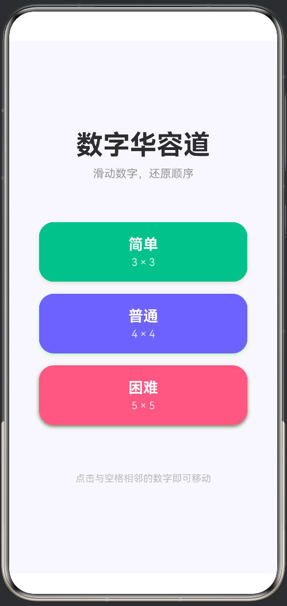
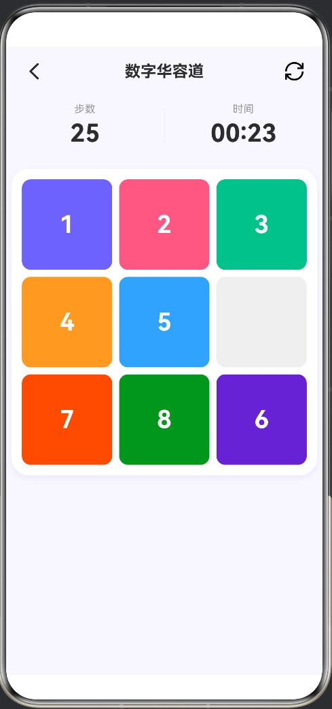

# 🧩 数字华容道 | HarmonyOS ArkTS 益智小游戏
> 基于 **ArkTS + ArkUI** 开发的经典数字华容道鸿蒙应用，适配HarmonyOS 6.1.0(23)，支持3×3/4×4/5×5三档难度。

## 📖 项目简介
经典数字华容道单机益智游戏，点击空白格相邻数字方块完成移动，将数字按从小到大顺序排列即可通关；自动统计**移动步数、游戏用时、游戏效率**，通关弹出结算评分页面，支持重新开局与返回首页。
- 简单：3×3棋盘（1~8+空白）
- 普通：4×4棋盘（1~15+空白）
- 困难：5×5棋盘（1~24+空白）

## ⚙️ 技术栈
- **开发语言：ArkTS（方舟TS）**
- **UI框架：ArkUI声明式组件**
- **系统版本：HarmonyOS 6.1.0(API 23)**
- **开发工具：DevEco Studio**
- **架构：MVVM（GameViewModel视图模型分层）**

## ✨ 核心功能
1. **三档难度选择**：首页点击不同配色卡片，进入对应规格棋盘游戏
2. **格子点击移动**：仅空白格相邻方块可点击换位，附带方块弹出动画（120ms缓动）
3. **实时数据统计**：对局实时展示总步数、倒计时，自动格式化时分时间
4. **随机合法棋盘**：洗牌算法保证生成**有解棋盘**，自动规避无解/已完成开局
5. **通关结算系统**：完成拼图弹窗提示，跳转结算页展示难度、用时、步数、每分钟步数效率，附带评级（神速/优秀/不错/加油）
6. **快捷操作**：单局内刷新重开、返回首页，结算页一键再来一局/返回主页
7. **自适应样式**：不同棋盘尺寸自动适配方块字体大小、配色随机分配

## 📂 项目目录结构
```
entry/src/main/ets/
├── pages
│   ├── Index.ets        # 首页难度选择页面
│   ├── GamePage.ets    # 游戏对局主页面
│   └── ResultPage.ets  # 通关结算页面
├── model
│   └── PuzzleModel.ets # 难度枚举、配置、常量定义
├── viewmodel
│   └── GameViewModel.ets # MVVM视图模型（游戏逻辑、计时器、数据管理）
└── utils
└── PuzzleUtil.ets  # 工具类：棋盘生成、洗牌、可解性校验、移动算法、时间格式化
```

## 🚀 本地编译运行教程
1. 环境准备：安装 **DevEco Studio**，配置HarmonyOS SDK 6.1.0(API23)
2. 克隆/导入本项目到DevEco
```bash
git clone https://github.com/你的用户名/NumberPuzzle-HarmonyOS.git
```
3. 连接鸿蒙真机/模拟器/预览器（API≥23）
4. 点击运行按钮，编译安装应用

## 🎮 游戏操作说明
1. 打开App首页，选择【简单/普通/困难】进入对局
2. 点击空白方块周边数字方块，方块与空位互换位置
3. 数字从左至右、从上到下顺序排列即通关，自动弹出结算弹窗
4. 顶部左侧返回图标→退回首页；顶部刷新图标→本局重新开局

## 🧮 关键算法说明
1. **棋盘合法性校验**：通过逆序数算法判断棋盘是否存在可解路径，洗牌循环生成有效开局
2. **空位移动判定**：通过行列坐标计算，仅上下左右相邻格子允许移动
3. **完成判定**：遍历数组，数字顺序连续、末尾为空白(0)判定通关
4. **计时器管理**：页面销毁/重开局自动销毁定时器，避免后台计时损耗

## 📝 后续优化计划
- [ ] 新增本地历史成绩存档
- [ ] 增加一键提示、撤销上一步操作功能
- [ ] 适配鸿蒙折叠屏、平板多尺寸布局
- [ ] 新增闯关排行榜

## 📄 开源协议
本项目采用 **MIT License**，可自由学习、二次修改、商用使用。

## 游戏截图


